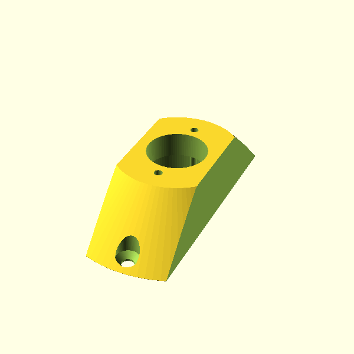
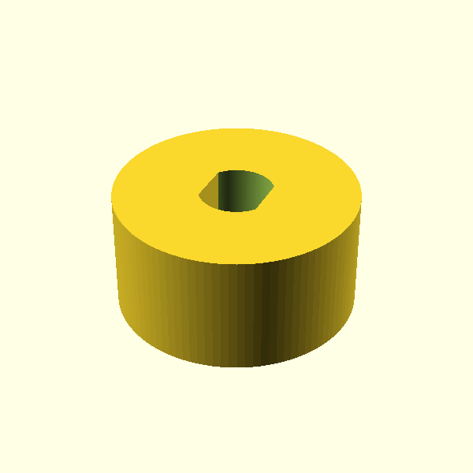
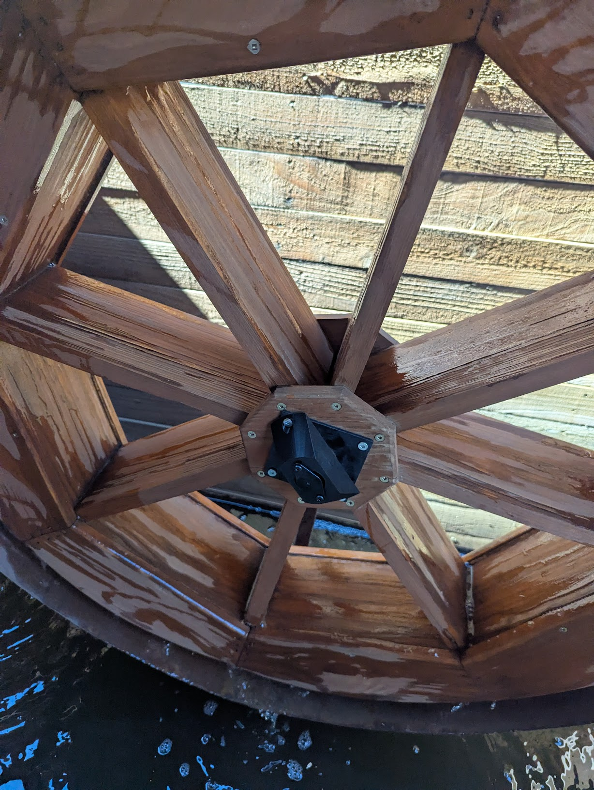
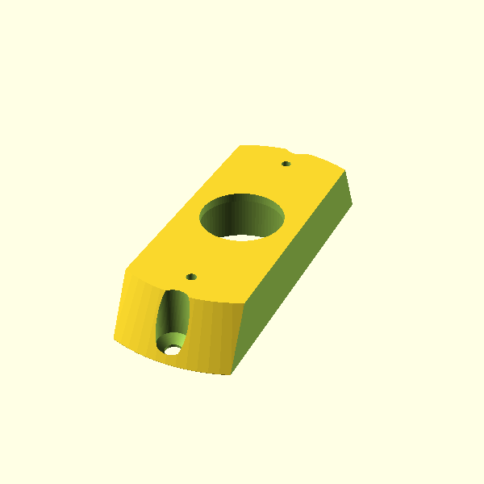
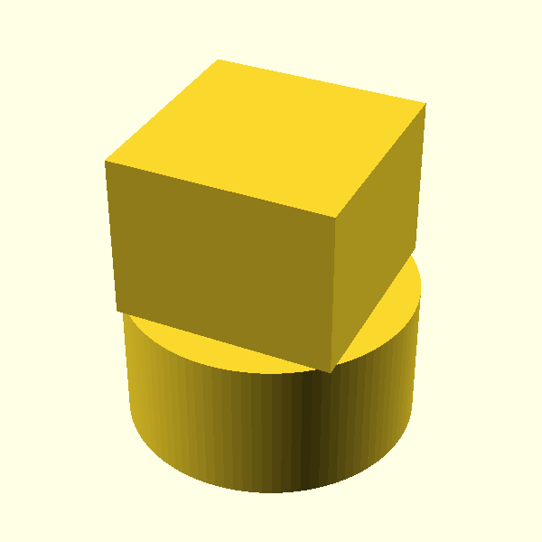

# water feature wheel damper

wheel was spinning too fast.  

## Small Damper

[This](https://www.amazon.com/Bansbach-Easylift-FRN-D3-R501-G1-Standard/dp/B01N9MPNG3/) small rotoary damper used to slow it a touch.  It might need a more viscous one.

Outer mount, small damper

  

### installed

## Large Damper

  

